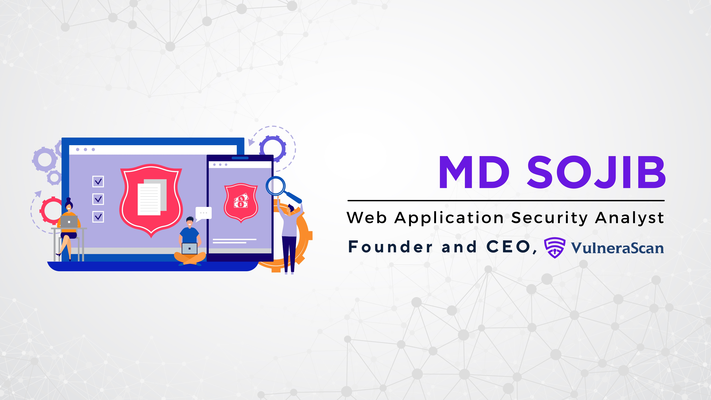

### 🪧 About Me

  

I'm MD SOJIB, Web Application Security Analyst 🧑‍💻️ Bug Hunter, Web Pen Tester from Rajshahi, Bangladesh 🇧🇩. I am a passionate Web Application Security Analyst with a strong interest in emerging threats and vulnerabilities. I have a proven track record of conducting research, analyzing data, and developing innovative solutions to security problems.I am always eager to share my knowledge and expertise with others.

### 🏛️ Contact Me

    

### 👨‍🦱 Github Stats

  

 

### 💼 Employment History

| Position            | Institute                                   | Duration            | Location           |
| ------------------- | ------------------------------------------- | ------------------- | ------------------ |
| IT Manager   | Bonolota Food                                     | Oct 2022 - Feb 2023 | Rajshahi, Bangladesh   |

 

### 👨🏻‍🎓 Education

1. BBA in Accounting at National University.
2. HSC in Science at Varendra College, Rajshahi, Bangladesh. 
3. SSC in Science at Nachole Pilot High School, Chapainawabganj, Bangladesh. 

 

### 🈯 Languages:

-  Bangla : Native
-  English : Advanced
-  Hindi : Intermediate
-  Arabic : Basic
   

### 🔊 Activities:

- 🏏 Cricket, ⚽ Football,
- 🏃‍♂️ Running, 🚶‍♂️ Walking
- ✈️ Travelling, 🚲 Cycling 

 

---

Thanks for going through my Portfolio.
All rights reserved by MD SOJIB @2024

